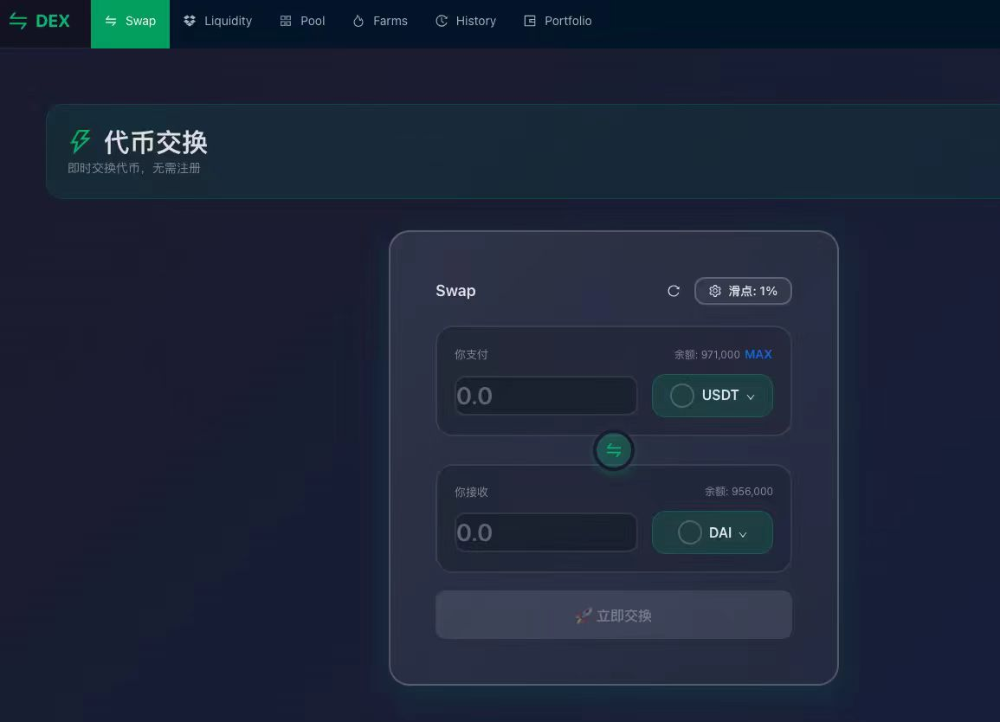
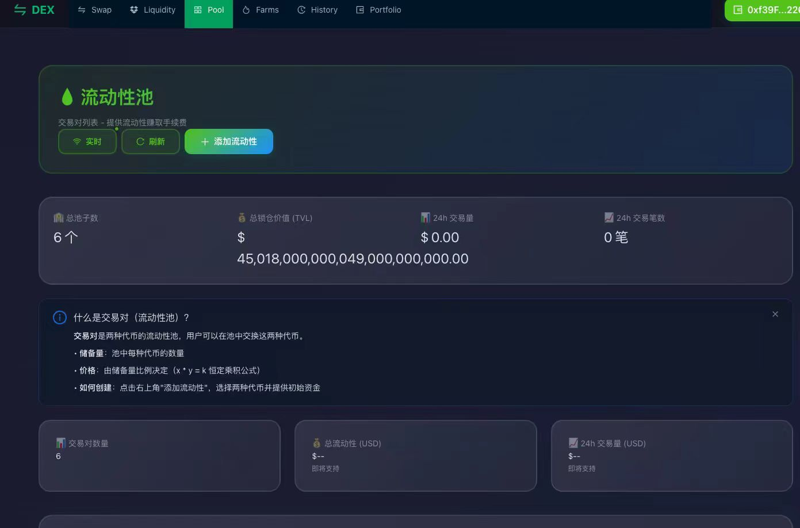
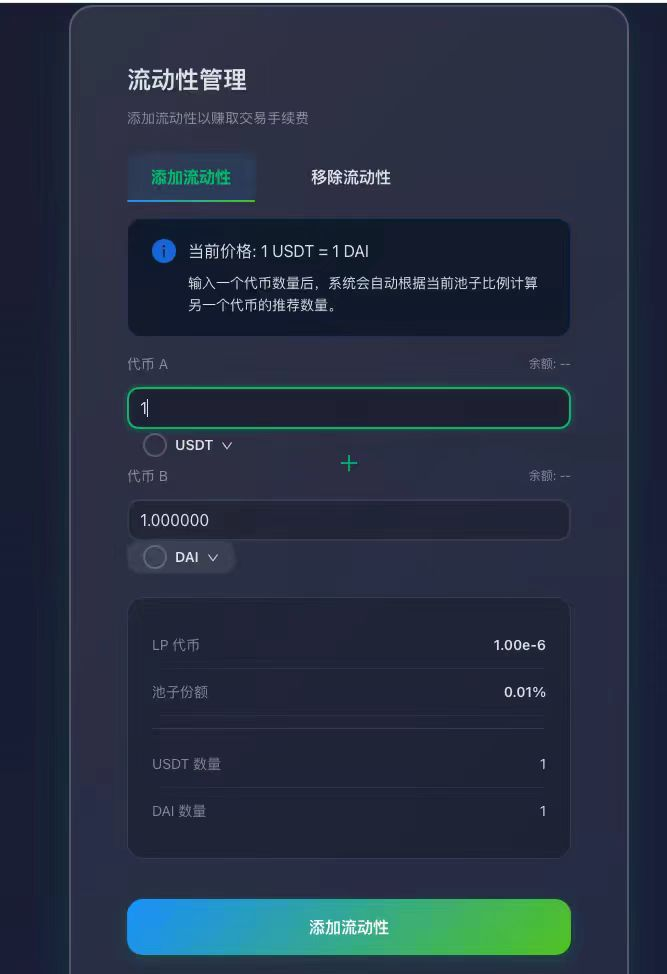
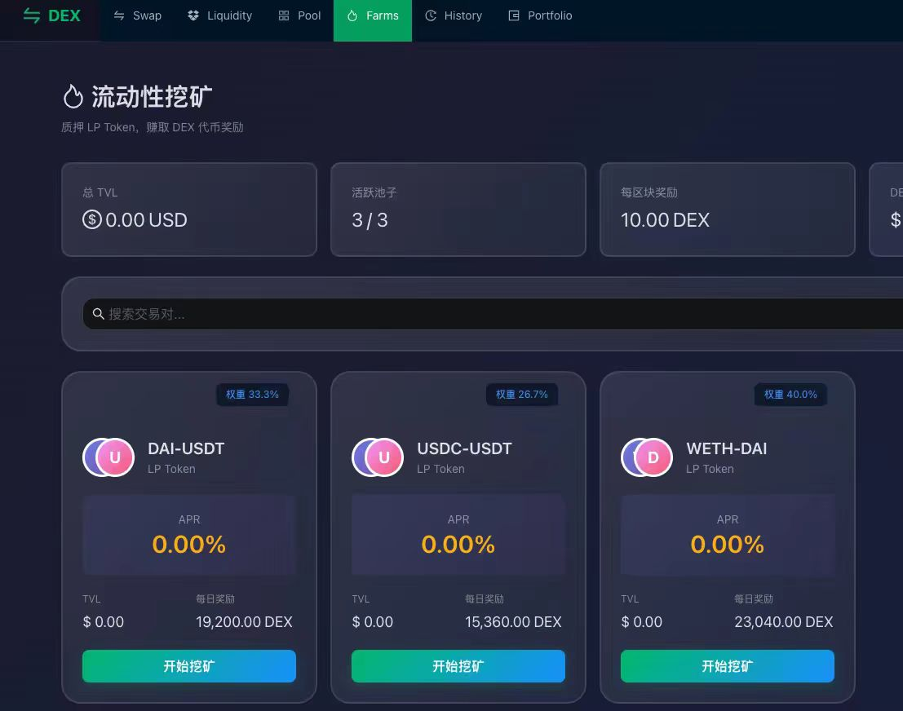
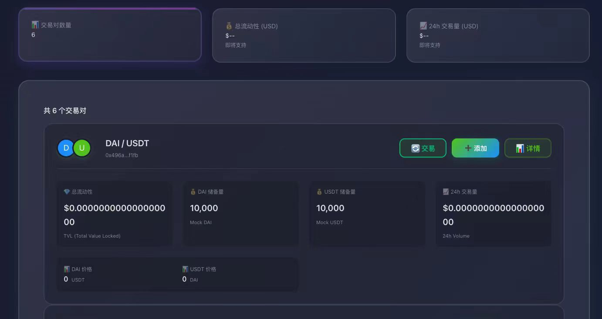
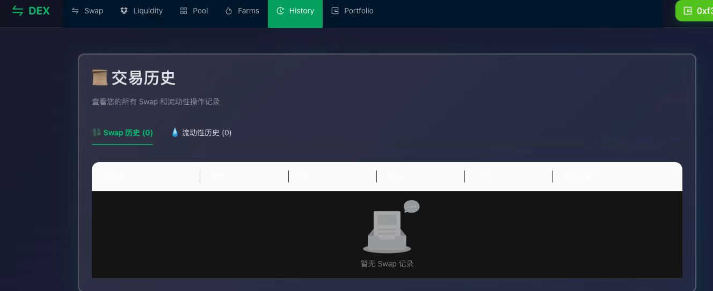

# 🚀 DEX - Decentralized Exchange

> Enterprise-grade DEX implementation based on UniswapV2 with modern tech stack, fully open-source.

[English](./README_EN.md) | [简体中文](./README.md)

[](https://opensource.org/licenses/MIT)
[](https://www.typescriptlang.org/)
[](https://reactjs.org/)
[](https://nestjs.com/)
[](https://soliditylang.org/)
[](CONTRIBUTING.md)

---

## 📖 Introduction

A full-featured decentralized exchange (DEX) featuring:

- ✅ **Swap** - Token exchange with AMM algorithm
- ✅ **Liquidity** - Add/remove liquidity
- ✅ **Pool** - Liquidity pool management
- ✅ **Farms** - Liquidity mining (MasterChef)
- ✅ **Price Oracle** - Price feeds (Chainlink)
- ✅ **History** - Complete transaction history
- ✅ **Analytics** - Data analysis and statistics
- ✅ **Real-time** - WebSocket live updates
- 🔄 **The Graph** - Data indexing and fast queries (In Development)

### 🌟 Highlights

- **Truly Decentralized** - Users manage private keys through MetaMask
- **Modern Architecture** - Frontend calls contracts directly, backend provides read-only services
- **Complete Analytics** - Historical records, statistics, real-time monitoring
- **Production-Ready** - Refactored and optimized code, clean and maintainable

---

## 📸 Screenshots

### 💱 Swap - Token Exchange


*Instantly swap any ERC20 tokens with slippage protection*

### 💧 Pool - Liquidity Pools


*View all trading pairs with TVL and APY at a glance*

### ➕ Add Liquidity - Provide Liquidity


*Become a liquidity provider and earn trading fees*

### 🌾 Farms - Liquidity Mining


*Stake LP tokens to earn additional rewards*

### 📊 Pool Detail - Pool Information


*Detailed pool information and staking interface*

### 📜 History - Transaction Records


*Complete Swap and liquidity operation history*

---

## 🎯 Why This Project?

### Comparison with Other DEX Implementations

| Feature | This Project | Others |
|---------|-------------|---------|
| **Completeness** | ✅ Swap + Liquidity + Analytics | ⚠️ Basic features only |
| **Architecture** | ✅ Production-grade, microservices | ⚠️ Simple examples |
| **Documentation** | ✅ 15+ detailed guides | ⚠️ Basic README |
| **Code Quality** | ✅ TypeScript + ESLint + Comments | ⚠️ JavaScript, few comments |
| **Real-time Data** | ✅ WebSocket + Event listeners | ❌ None |
| **Analytics** | ✅ History + Statistics | ❌ None |

### Use Cases

- 🎓 **Learn DeFi Development**: Complete DEX implementation for Web3 learning
- 🚀 **Rapid Prototyping**: Build your own DEX quickly
- 📚 **Educational Reference**: Clear code, comprehensive docs
- 🏢 **Enterprise Projects**: Production-ready code for commercial use

---

## 🏗️ Tech Stack

### Smart Contracts
- **Solidity** - Contract language
- **Hardhat** - Development framework
- **UniswapV2** - AMM protocol

### Backend
- **NestJS** - Node.js framework
- **TypeScript** - Type safety
- **TypeORM** - ORM framework
- **PostgreSQL** - Database
- **Redis** - Cache
- **Socket.IO** - WebSocket real-time communication
- **Viem** - Ethereum library (read-only)
- **The Graph** - Blockchain data indexing (In Development)
- **GraphQL** - Data query language

### Frontend
- **React 18** - UI framework
- **TypeScript** - Type safety
- **Vite** - Build tool
- **Ant Design** - UI component library
- **Wagmi** - React Hooks for Ethereum
- **Viem** - Ethereum library
- **Zustand** - State management
- **React Query** - Data fetching

---

## 🚀 Quick Start

### Prerequisites

- Node.js >= 18
- pnpm >= 8
- PostgreSQL >= 14
- MetaMask wallet

### 1. Clone Repository

```bash
git clone https://github.com/your-username/dex.git
cd dex
```

### 2. One-Click Start

```bash
# See detailed steps
cat START_ALL.md

# Or quick start guide
cat GETTING_STARTED.md
```

### 3. Access Application

- **Frontend:** http://localhost:3000
- **Backend API:** http://localhost:3002
- **API Docs:** http://localhost:3002/api
- **Wallet Service:** http://localhost:3001

---

## 📊 Project Status

**Overall Completion:** 85% | **Current Phase:** Phase 6.5 In Development

### ✅ Completed Features

- **Phase 1** - Core Features ✅ (2025-10-25)
  - Smart contracts (Factory, Pair, Router)
  - Swap, Liquidity, Pool features
  - Frontend basic features
  - Backend API (52+ endpoints)
  - MetaMask integration

- **Phase 2** - Real-time Data Sync ✅ (2025-10-28)
  - Blockchain event listening
  - WebSocket live updates
  - Auto data synchronization
  - Scheduled tasks

- **Phase 3** - Data Analytics ✅ (2025-10-30)
  - Transaction history
  - Liquidity history
  - TVL and volume statistics
  - User activity tracking

- **Phase 4** - Slippage Optimization ✅ (2025-10-31)
  - Slippage calculation and display
  - Price impact warnings
  - Minimum received protection
  - Custom slippage settings

- **Phase 5** - Liquidity Mining ✅ (2025-11-02)
  - MasterChef contract
  - LP token staking
  - Reward distribution
  - APR calculation
  - Farms page

- **Phase 6** - Price Oracle ✅ (2025-11-19)
  - PriceOracle contract
  - Chainlink integration
  - USD price queries
  - Frontend price display
  - Auto price updates

### 🔄 In Development

- **Phase 6.5** - The Graph Integration (75% Complete)
  - ✅ Subgraph development (Uniswap V2 + Farming)
  - ✅ Backend GraphQL client
  - ✅ REST API wrapper
  - ⏳ Local testing
  - ⏳ Production deployment
  - ⏳ Frontend Apollo Client integration

### 📝 Upcoming Features

- **Phase 7** - Limit Orders (Expected 2025-11-23)
  - Limit order contracts
  - Order book management
  - Auto execution mechanism

- **Phase 8** - Multi-chain Support (Expected 2025-11-30)
  - BSC / Polygon support
  - Chain switching
  - Multi-chain data aggregation

- **Phase 9** - Cross-chain Bridge (Expected 2025-12-05)
  - Cross-chain asset transfer
  - Bridge contracts
  - Security validation

---

## 📚 Documentation

### Core Docs

| Document | Description |
|----------|-------------|
| [GETTING_STARTED.md](./GETTING_STARTED.md) | Quick start guide |
| [START_ALL.md](./START_ALL.md) | Start all services |
| [ARCHITECTURE.md](./ARCHITECTURE.md) | Architecture overview (853 lines) |
| [QUICK_REFERENCE.md](./QUICK_REFERENCE.md) | Quick reference |
| [docs/PROJECT_STATUS.md](./docs/PROJECT_STATUS.md) | 📊 Project Status Overview ⭐ |
| [docs/UPDATED_ROADMAP.md](./docs/UPDATED_ROADMAP.md) | 🗺️ Development Roadmap |

### Featured Docs

| Document | Description |
|----------|-------------|
| [docs/phases/phase5/FARMING_EXPLAINED.md](./docs/phases/phase5/FARMING_EXPLAINED.md) | 🌾 Liquidity Mining Explained |
| [docs/THE_GRAPH_EXPLAINED.md](./docs/THE_GRAPH_EXPLAINED.md) | 📊 The Graph Beginner's Guide ⭐ |
| [docs/phases/phase6/PRODUCTION_DEPLOYMENT.md](./docs/phases/phase6/PRODUCTION_DEPLOYMENT.md) | 🚀 Production Deployment Guide |

### Detailed Docs

| Directory | Description |
|-----------|-------------|
| [docs/README.md](./docs/README.md) | 📖 Documentation index (recommended) |
| [docs/phases/](./docs/phases/) | 🎯 Development phase records |
| [docs/guides/](./docs/guides/) | 📖 User guides |
| [docs/maintenance/](./docs/maintenance/) | 🧹 Maintenance docs |
| [docs/troubleshooting/](./docs/troubleshooting/) | 🔧 Troubleshooting |

---

## 🎯 Core Concepts

### User Perspective

```
User → MetaMask → Smart Contracts
         ↓
    Sign Transaction
         ↓
   On-chain Execution (Decentralized)
```

### System Architecture

```
┌─────────────────────────────────────────────┐
│                   Frontend                   │
│   (React + Viem + MetaMask)                 │
│   - Direct contract calls                    │
│   - Backend API queries                      │
└──────────────┬──────────────────────────────┘
               │
               ├──────────────┐
               │              │
               ▼              ▼
      ┌────────────┐   ┌──────────────┐
      │  Contracts │   │   Backend     │
      │ (Solidity) │   │   (NestJS)    │
      │            │   │  - Read API   │
      │ - Swap     │   │  - Analytics  │
      │ - Pool     │   │  - Events     │
      │ - Router   │   │  - Real-time  │
      └────────────┘   └──────────────┘
            ▲                  │
            │                  │
            └──────────────────┘
           Blockchain Events
```

---

## 🔧 Development

### Project Structure

```
dex/
├── contracts/          # Smart contracts
│   ├── contracts/      # Solidity contracts
│   │   ├── core/       # Core contracts (Factory, Pair, Router)
│   │   ├── farming/    # Farming contracts (MasterChef)
│   │   └── oracle/     # Price oracle (PriceOracle)
│   └── scripts/        # Deployment scripts
│
├── backend/            # Backend services
│   └── services/
│       ├── analytics-service/  # Data analytics service
│       │   ├── modules/
│       │   │   ├── price/      # Price service
│       │   │   └── thegraph/   # The Graph integration
│       │   └── ...
│       └── wallet-service/     # Wallet service
│
├── frontend/           # Frontend app
│   └── web-app/        # React app
│       ├── src/
│       │   ├── pages/          # Pages (Swap, Pools, Farms...)
│       │   ├── hooks/          # React Hooks
│       │   └── components/     # Components
│       └── ...
│
├── subgraph/           # The Graph Subgraph (New)
│   ├── schema.graphql  # GraphQL Schema
│   ├── subgraph.yaml   # Config file
│   └── src/mappings/   # Event handlers
│
├── docs/               # Documentation
│   ├── README.md       # Documentation index
│   ├── PROJECT_STATUS.md      # Project status overview
│   ├── THE_GRAPH_EXPLAINED.md # The Graph explained
│   ├── phases/         # Development records
│   └── ...            # Other docs
│
├── scripts/            # Test scripts
└── tests/              # Tests
```

### Common Commands

```bash
# Mint tokens
bash scripts/mint-tokens-simple.sh

# Sync pool data
bash scripts/sync-all-pools.sh

# Test API
bash scripts/test-analytics-api.sh
```

---

## 🤝 Contributing

Contributions welcome! See [CONTRIBUTING.md](./docs/CONTRIBUTING.md)

### Development Standards

- **Code Style** - ESLint + Prettier
- **Commit Convention** - Conventional Commits
- **Branch Strategy** - Git Flow
- **Testing** - Unit tests + Integration tests

---

## 📄 License

MIT License - See [LICENSE](./LICENSE)

---

## 🌟 Acknowledgments

- [Uniswap V2](https://uniswap.org/) - AMM protocol
- [NestJS](https://nestjs.com/) - Backend framework
- [React](https://reactjs.org/) - Frontend framework
- [Viem](https://viem.sh/) - Ethereum library
- [Wagmi](https://wagmi.sh/) - React Hooks

---

## 📞 Contact

- **GitHub Issues** - Bug reports
- **Discussions** - Community discussions

---

**Project Status:** ✅ Phase 6 Complete, Phase 6.5 In Development (85% Overall Completion)  
**Last Updated:** 2025-11-20  
**Maintainers:** DEX Team

---

## 📈 Project Highlights

### Implemented Core Features

✅ **8 Smart Contracts** - Factory, Pair, Router, WETH, MasterChef, RewardToken, PriceOracle, Mock Aggregator  
✅ **62+ REST API Endpoints** - Complete backend services  
✅ **10+ GraphQL Queries** - The Graph data indexing (In Development)  
✅ **7 Frontend Pages** - Swap, Liquidity, Pools, Farms, History...  
✅ **Real-time Updates** - WebSocket support  
✅ **Price Oracle** - Chainlink integration, USD price display  
✅ **Liquidity Mining** - Complete Staking and Rewards system  
✅ **74,500+ Lines of Code** - Production-grade code quality

### Technical Features

🚀 **Performance Optimized** - The Graph indexing, 10-100x faster queries  
🔒 **Security First** - Comprehensive permission control and input validation  
📚 **Well-documented** - 20,000+ lines of detailed documentation  
🧪 **Fully Tested** - Unit tests + Integration tests + E2E tests  
🎨 **Modern UI** - Ant Design + Responsive design

### Latest Updates (2025-11-20)

- ✅ Phase 6: Price Oracle completed
- ✅ Chainlink integration
- ✅ USD price display
- 🔄 Phase 6.5: The Graph Integration (75% complete)
  - ✅ Subgraph development complete (~1,500 lines)
  - ✅ Backend GraphQL client complete (~1,000 lines)
  - ✅ The Graph beginner's guide (1,417 lines)
  - ⏳ Local testing and deployment

📖 **Detailed Progress** See [PROJECT_STATUS.md](./docs/PROJECT_STATUS.md)

