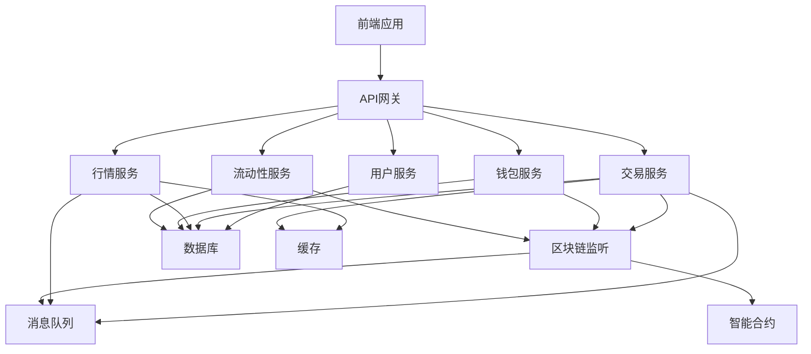

# DEX 模块详细划分

## 模块总览

```
DEX系统
├── 智能合约模块
├── 后端服务模块
├── 前端应用模块
├── 基础设施模块
└── 运营管理模块
```

---

## 1. 智能合约模块

### 1.1 核心交易合约

#### 1.1.1 工厂合约 (DEXFactory)
**文件**: `contracts/core/DEXFactory.sol`

**职责**:
- 创建新的交易对
- 管理所有交易对地址
- 设置交易手续费
- 权限控制

**主要函数**:
```solidity
function createPair(address tokenA, address tokenB) external returns (address pair)
function getPair(address tokenA, address tokenB) external view returns (address pair)
function allPairs(uint) external view returns (address pair)
function setFeeTo(address) external
function setFeeToSetter(address) external
```

**依赖**:
- DEXPair合约模板
- 访问控制合约

#### 1.1.2 交易对合约 (DEXPair)
**文件**: `contracts/core/DEXPair.sol`

**职责**:
- 实现AMM(自动做市商)算法
- 管理流动性池
- 执行代币交换
- 铸造和销毁LP代币
- 价格预言机(TWAP)

**主要函数**:
```solidity
function mint(address to) external returns (uint liquidity)
function burn(address to) external returns (uint amount0, uint amount1)
function swap(uint amount0Out, uint amount1Out, address to, bytes calldata data) external
function skim(address to) external
function sync() external
function getReserves() external view returns (uint112 reserve0, uint112 reserve1, uint32 blockTimestampLast)
```

**核心算法**:
- Constant Product Formula: `x * y = k`
- 价格影响计算
- 滑点保护

#### 1.1.3 路由合约 (DEXRouter)
**文件**: `contracts/periphery/DEXRouter.sol`

**职责**:
- 提供用户友好的交易接口
- 多跳交易路径计算
- 添加/移除流动性
- 处理ETH包装/解包装
- 滑点保护

**主要函数**:
```solidity
// 添加流动性
function addLiquidity(
    address tokenA,
    address tokenB,
    uint amountADesired,
    uint amountBDesired,
    uint amountAMin,
    uint amountBMin,
    address to,
    uint deadline
) external returns (uint amountA, uint amountB, uint liquidity)

// 移除流动性
function removeLiquidity(
    address tokenA,
    address tokenB,
    uint liquidity,
    uint amountAMin,
    uint amountBMin,
    address to,
    uint deadline
) external returns (uint amountA, uint amountB)

// 交换代币
function swapExactTokensForTokens(
    uint amountIn,
    uint amountOutMin,
    address[] calldata path,
    address to,
    uint deadline
) external returns (uint[] memory amounts)

function swapTokensForExactTokens(
    uint amountOut,
    uint amountInMax,
    address[] calldata path,
    address to,
    uint deadline
) external returns (uint[] memory amounts)
```

### 1.2 治理模块

#### 1.2.1 治理代币 (GovernanceToken)
**文件**: `contracts/governance/GovernanceToken.sol`

**职责**:
- ERC20代币
- 投票权重记录
- 代理投票
- 快照机制

**特性**:
- ERC20Votes
- ERC20Permit
- 可铸造(初期)
- 可暂停(紧急情况)

#### 1.2.2 治理合约 (Governor)
**文件**: `contracts/governance/DEXGovernor.sol`

**职责**:
- 提案创建
- 投票管理
- 提案执行
- 参数调整

**提案类型**:
- 修改交易手续费
- 添加新的代币对
- 升级合约
- 分配国库资金

#### 1.2.3 时间锁 (Timelock)
**文件**: `contracts/governance/Timelock.sol`

**职责**:
- 延迟执行提案
- 给予用户反应时间
- 提高安全性

### 1.3 安全模块

#### 1.3.1 多签钱包 (MultiSig)
**文件**: `contracts/security/MultiSig.sol`

**职责**:
- 多签管理
- 关键操作审批
- 资金安全保护

#### 1.3.2 紧急暂停 (EmergencyStop)
**文件**: `contracts/security/EmergencyStop.sol`

**职责**:
- 紧急暂停交易
- 保护用户资金
- 事件通知

#### 1.3.3 保险基金 (Insurance)
**文件**: `contracts/security/Insurance.sol`

**职责**:
- 收集保险费
- 赔付处理
- 基金管理

### 1.4 高级功能模块

#### 1.4.1 聚合交易 (Aggregator)
**文件**: `contracts/advanced/Aggregator.sol`

**职责**:
- 跨DEX路由
- 最优价格查找
- 拆单执行

#### 1.4.2 限价单 (LimitOrder)
**文件**: `contracts/advanced/LimitOrder.sol`

**职责**:
- 创建限价单
- 订单匹配
- 自动执行

#### 1.4.3 流动性挖矿 (LiquidityMining)
**文件**: `contracts/farming/LiquidityMining.sol`

**职责**:
- 质押LP代币
- 计算奖励
- 分发治理代币

#### 1.4.4 单边流动性 (SingleSided)
**文件**: `contracts/advanced/SingleSidedLiquidity.sol`

**职责**:
- 允许单币种添加流动性
- 自动换币和配对
- 降低无常损失

---

## 2. 后端服务模块

### 2.1 API网关模块
**目录**: `backend/api-gateway/`

**技术栈**: Kong / Node.js + Express

**子模块**:
- 路由管理
- 认证中间件
- 限流中间件
- 日志中间件
- 错误处理

**配置文件**:
```
config/
  - routes.yaml
  - rate-limits.yaml
  - auth.yaml
```

### 2.2 用户服务模块
**目录**: `backend/services/user-service/`

**技术栈**: NestJS + TypeScript

**子模块**:

#### 2.2.1 认证子模块
```
src/auth/
  - auth.controller.ts
  - auth.service.ts
  - jwt.strategy.ts
  - local.strategy.ts
```

**功能**:
- 登录/注册
- JWT生成和验证
- 刷新令牌
- 密码重置

#### 2.2.2 用户管理子模块
```
src/user/
  - user.controller.ts
  - user.service.ts
  - user.entity.ts
  - user.repository.ts
```

**功能**:
- 用户信息CRUD
- 钱包地址绑定
- 用户设置

#### 2.2.3 KYC子模块
```
src/kyc/
  - kyc.controller.ts
  - kyc.service.ts
  - kyc.entity.ts
  - kyc-provider.interface.ts
```

**功能**:
- 身份验证
- 文档上传
- 第三方KYC集成(Jumio, Onfido)
- 验证状态管理

#### 2.2.4 权限管理子模块
```
src/rbac/
  - roles.guard.ts
  - permissions.decorator.ts
  - rbac.service.ts
```

**功能**:
- 角色定义
- 权限检查
- 访问控制

### 2.3 交易服务模块
**目录**: `backend/services/trading-service/`

**技术栈**: NestJS + TypeScript + Worker Threads

**性能优化**:
- Cluster模式多进程
- Worker Threads处理CPU密集任务
- fastpriorityqueue高性能队列
- piscina线程池管理

**子模块**:

#### 2.3.1 订单簿模块
```
src/orderbook/
  - orderbook.module.ts
  - orderbook.service.ts
  - orderbook.controller.ts
  - order.entity.ts
  - priority-queue.ts
```

**功能**:
- 订单簿维护
- 买卖单管理
- 价格级别聚合

#### 2.3.2 订单匹配引擎
```
src/matching/
  - matching.module.ts
  - matching.service.ts
  - matcher.worker.ts    # Worker线程
  - engine.ts
```

**功能**:
- 订单匹配算法
- 价格优先时间优先
- 部分成交处理
- Worker线程并行匹配

#### 2.3.3 交易执行模块
```
src/execution/
  - execution.module.ts
  - execution.service.ts
  - transaction.service.ts
  - gas-estimator.ts
```

**功能**:
- 构建交易
- Gas估算和优化（viem）
- 交易签名
- 交易广播

#### 2.3.4 MEV保护模块
```
src/mev/
  - mev.module.ts
  - flashbots.service.ts
  - private-rpc.service.ts
  - protection.service.ts
```

**功能**:
- Flashbots集成
- 私有交易池
- 三明治攻击防护

### 2.4 行情服务模块
**目录**: `backend/services/market-data-service/`

**技术栈**: Node.js + NestJS

**子模块**:

#### 2.4.1 实时价格模块
```
src/price/
  - price.gateway.ts (WebSocket)
  - price.service.ts
  - price-aggregator.ts
```

**功能**:
- 实时价格推送
- 多源价格聚合
- 价格异常检测

#### 2.4.2 K线数据模块
```
src/kline/
  - kline.controller.ts
  - kline.service.ts
  - kline-generator.ts
```

**功能**:
- K线数据生成(1m, 5m, 15m, 1h, 4h, 1d)
- 历史K线查询
- 实时K线更新

#### 2.4.3 深度数据模块
```
src/depth/
  - depth.gateway.ts
  - depth.service.ts
  - depth-aggregator.ts
```

**功能**:
- 订单簿深度数据
- 买卖盘聚合
- WebSocket推送

#### 2.4.4 交易历史模块
```
src/trades/
  - trades.controller.ts
  - trades.service.ts
```

**功能**:
- 最近成交记录
- 成交历史查询
- 大额交易提醒

### 2.5 钱包服务模块
**目录**: `backend/services/wallet-service/`

**技术栈**: NestJS + TypeScript + viem

**Web3集成**:
- viem (主要库)
- 支持批量查询(multicall)
- Redis缓存余额
- WebSocket实时更新

**子模块**:

#### 2.5.1 地址管理模块
```
src/address/
  - address.module.ts
  - address.service.ts
  - validator.ts
```

**功能**:
- 地址生成
- 地址验证
- 多链地址管理

#### 2.5.2 余额管理模块
```
src/balance/
  - balance.module.ts
  - balance.service.ts
  - multicall.service.ts
  - cache.service.ts
```

**功能**:
- 实时余额查询（viem）
- 多币种余额
- 批量查询（multicall）
- Redis缓存优化

#### 2.5.3 交易监控模块
```
src/monitor/
  - monitor.module.ts
  - deposit.monitor.ts
  - withdrawal.monitor.ts
  - confirmation.tracker.ts
```

**功能**:
- 充值监控（WebSocket）
- 提现处理
- 交易确认追踪
- 区块重组处理

#### 2.5.4 密钥管理模块
```
src/keys/
  - keys.module.ts
  - kms.service.ts
  - signer.service.ts
```

**功能**:
- 密钥存储(KMS/HSM)
- 交易签名
- 多签管理

### 2.6 流动性服务模块
**目录**: `backend/services/liquidity-service/`

**技术栈**: NestJS

**子模块**:

#### 2.6.1 流动性池管理
```
src/pool/
  - pool.controller.ts
  - pool.service.ts
  - pool.entity.ts
```

**功能**:
- 池子信息管理
- TVL计算
- APR/APY计算

#### 2.6.2 LP代币管理
```
src/lp-token/
  - lp-token.service.ts
  - lp-position.entity.ts
```

**功能**:
- LP持仓追踪
- 收益计算
- 份额管理

#### 2.6.3 流动性挖矿
```
src/farming/
  - farming.controller.ts
  - farming.service.ts
  - reward-calculator.ts
```

**功能**:
- 质押管理
- 奖励计算
- 奖励分发

### 2.7 区块链监听模块
**目录**: `backend/services/blockchain-listener/`

**技术栈**: NestJS + TypeScript + viem

**WebSocket集成**:
- viem WebSocket transport
- 自动重连机制
- 多链同时监听
- Bull队列异步处理

**子模块**:

#### 2.7.1 事件监听
```
src/listener/
  - listener.module.ts
  - event-listener.service.ts
  - block-listener.service.ts
  - log-parser.ts
```

**功能**:
- 智能合约事件监听（viem watchContractEvent）
- 区块监听
- 日志解析
- WebSocket断线重连

#### 2.7.2 事件处理
```
src/handler/
  - handler.module.ts
  - swap.handler.ts
  - liquidity.handler.ts
  - transfer.handler.ts
```

**功能**:
- Swap事件处理（@Processor装饰器）
- 流动性变动处理
- 转账事件处理
- 批量数据库更新

#### 2.7.3 数据同步
```
src/sync/
  - sync.module.ts
  - syncer.service.ts
  - state-manager.ts
  - reorg.handler.ts
```

**功能**:
- 链上数据同步
- 状态管理（Redis）
- 重组处理
- 历史数据回填

### 2.8 通知服务模块
**目录**: `backend/services/notification-service/`

**技术栈**: Node.js

**子模块**:

#### 2.8.1 邮件通知
```
src/email/
  - email.service.ts
  - email-templates/
  - email.queue.ts
```

#### 2.8.2 短信通知
```
src/sms/
  - sms.service.ts
  - sms-provider.interface.ts
```

#### 2.8.3 推送通知
```
src/push/
  - push.service.ts
  - fcm.service.ts
  - apns.service.ts
```

#### 2.8.4 站内消息
```
src/inbox/
  - inbox.controller.ts
  - inbox.service.ts
  - message.entity.ts
```

### 2.9 分析服务模块
**目录**: `backend/services/analytics-service/`

**技术栈**: Python + FastAPI

**子模块**:

#### 2.9.1 交易分析
```
src/trading/
  - volume_analyzer.py
  - price_analyzer.py
  - arbitrage_detector.py
```

#### 2.9.2 用户分析
```
src/user/
  - behavior_analyzer.py
  - cohort_analyzer.py
  - retention_calculator.py
```

#### 2.9.3 风险分析
```
src/risk/
  - risk_scorer.py
  - aml_checker.py
  - fraud_detector.py
```

---

## 3. 前端应用模块

### 3.1 Web前端模块
**目录**: `frontend/web-app/`

**技术栈**: React + TypeScript + Vite

**模块结构**:

#### 3.1.1 交易模块
```
src/features/trading/
  - components/
    - SwapWidget/
    - OrderForm/
    - TradingChart/
    - OrderBook/
    - TradeHistory/
  - hooks/
    - useSwap.ts
    - useOrderBook.ts
    - usePriceChart.ts
  - api/
    - trading.api.ts
```

**功能**:
- 代币交换界面
- 交易图表
- 订单簿显示
- 成交历史

#### 3.1.2 流动性模块
```
src/features/liquidity/
  - components/
    - AddLiquidity/
    - RemoveLiquidity/
    - PoolList/
    - PositionManager/
  - hooks/
    - useLiquidity.ts
    - usePool.ts
  - api/
    - liquidity.api.ts
```

**功能**:
- 添加流动性
- 移除流动性
- 流动性池浏览
- 持仓管理

#### 3.1.3 质押挖矿模块
```
src/features/farming/
  - components/
    - FarmList/
    - StakeModal/
    - RewardClaimer/
  - hooks/
    - useFarming.ts
    - useRewards.ts
```

**功能**:
- 质押LP代币
- 查看奖励
- 领取奖励

#### 3.1.4 钱包模块
```
src/features/wallet/
  - components/
    - WalletConnect/
    - AccountInfo/
    - AssetList/
    - TransactionHistory/
  - hooks/
    - useWallet.ts
    - useBalance.ts
  - connectors/
    - metamask.ts
    - walletconnect.ts
```

**功能**:
- 钱包连接
- 账户信息
- 资产列表
- 交易记录

#### 3.1.5 治理模块
```
src/features/governance/
  - components/
    - ProposalList/
    - ProposalDetail/
    - VoteModal/
    - CreateProposal/
  - hooks/
    - useGovernance.ts
    - useProposal.ts
```

**功能**:
- 查看提案
- 投票
- 创建提案

#### 3.1.6 用户中心模块
```
src/features/user/
  - components/
    - Profile/
    - Settings/
    - KYCVerification/
    - SecuritySettings/
  - hooks/
    - useUser.ts
```

**功能**:
- 个人资料
- 账户设置
- KYC验证
- 安全设置

### 3.2 移动端模块
**目录**: `frontend/mobile-app/`

**技术栈**: React Native

**主要模块**:
- 交易模块
- 钱包模块
- 资产模块
- 通知模块

### 3.3 管理后台模块
**目录**: `frontend/admin-dashboard/`

**技术栈**: Next.js

**模块结构**:

#### 3.3.1 数据监控模块
```
src/features/monitoring/
  - DashboardOverview/
  - TradingMetrics/
  - SystemHealth/
  - Alerts/
```

#### 3.3.2 用户管理模块
```
src/features/users/
  - UserList/
  - UserDetail/
  - KYCReview/
  - UserActions/
```

#### 3.3.3 交易管理模块
```
src/features/trades/
  - TradeList/
  - AbnormalTrades/
  - TradeAnalysis/
```

#### 3.3.4 系统配置模块
```
src/features/system/
  - Configuration/
  - FeatureFlags/
  - MaintenanceMode/
```

---

## 4. 基础设施模块

### 4.1 数据库模块
**目录**: `infrastructure/database/`

**内容**:
```
migrations/         # 数据库迁移
seeds/              # 测试数据
schemas/            # 数据库schema
backup-scripts/     # 备份脚本
```

### 4.2 缓存模块
**目录**: `infrastructure/cache/`

**配置**:
- Redis集群配置
- 缓存策略
- TTL设置

### 4.3 消息队列模块
**目录**: `infrastructure/message-queue/`

**内容**:
- Kafka主题配置
- RabbitMQ队列配置
- 消费者组配置

### 4.4 监控模块
**目录**: `infrastructure/monitoring/`

**内容**:
```
prometheus/
  - prometheus.yml
  - alerts.yml
grafana/
  - dashboards/
  - datasources/
elk/
  - logstash/
  - elasticsearch/
  - kibana/
```

### 4.5 部署模块
**目录**: `infrastructure/deployment/`

**内容**:
```
docker/
  - Dockerfile.*
  - docker-compose.*.yml
kubernetes/
  - deployments/
  - services/
  - configmaps/
  - secrets/
terraform/
  - aws/
  - gcp/
  - modules/
```

---

## 5. 运营管理模块

### 5.1 配置管理模块
**目录**: `config/`

**内容**:
- 环境配置
- 特性开关
- 业务参数

### 5.2 文档模块
**目录**: `docs/`

**内容**:
- API文档
- 架构文档
- 运维文档
- 用户手册

### 5.3 脚本工具模块
**目录**: `scripts/`

**内容**:
```
deployment/        # 部署脚本
maintenance/       # 运维脚本
migration/         # 数据迁移
testing/           # 测试脚本
```

---

## 模块依赖关系



---

## 模块开发优先级

### Phase 1: MVP (最小可行产品) - 全Node.js
1. 智能合约核心模块 (Factory, Pair, Router) - Solidity
2. 钱包服务基础模块 - NestJS + viem
3. 交易服务基础模块 - NestJS + Worker Threads
4. Web前端交易模块 - React + TypeScript
5. 区块链监听基础模块 - NestJS + viem

**预计时间**: 6-9周（比原计划快5-8周）

### Phase 2: 核心功能完善
1. 行情服务完整模块 - NestJS + WebSocket
2. 流动性服务模块 - NestJS
3. 用户服务完整模块 - NestJS
4. Web前端流动性模块 - React
5. 通知服务模块 - NestJS + Bull

**预计时间**: 4-6周

### Phase 3: 高级功能
1. 治理模块 - Solidity + NestJS
2. 流动性挖矿模块 - Solidity + NestJS
3. 限价单模块 - Solidity + NestJS
4. 聚合交易模块 - NestJS
5. 移动端应用 - React Native

**预计时间**: 8-10周

### Phase 4: 企业级功能
1. 管理后台完整模块 - Next.js
2. 分析服务模块 - NestJS (或Python)
3. 高级安全模块 - 全栈
4. 跨链模块 - NestJS + 跨链协议
5. Layer 2集成 - 适配

**预计时间**: 6-8周

**总计**: 约24-33周（比原Go混合方案快约30%）

